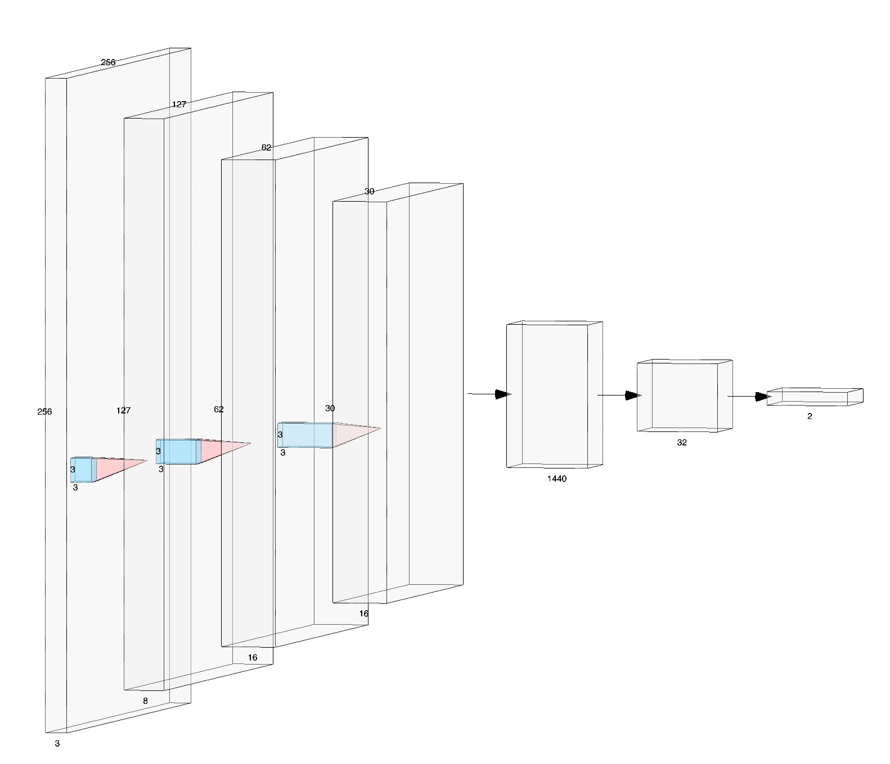
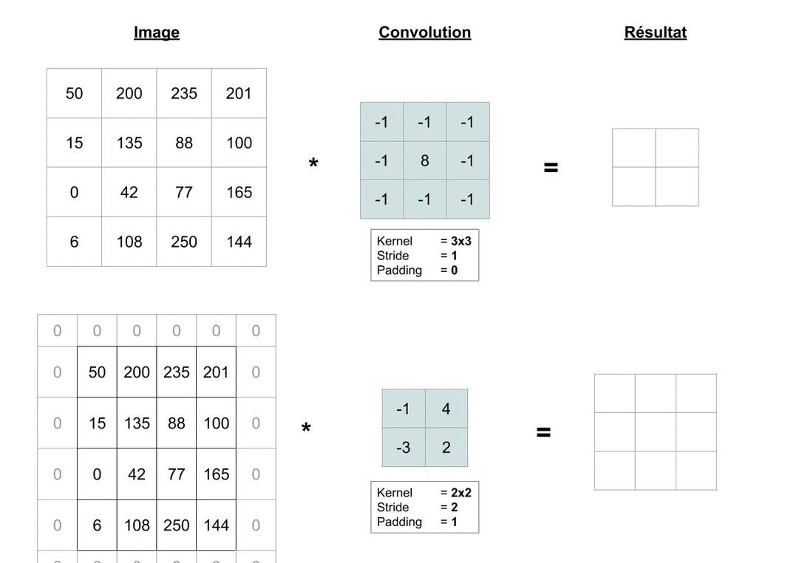
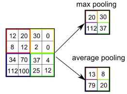
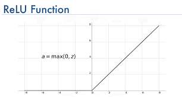
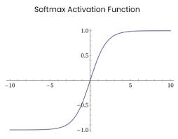

# Train a classifier 

This Classifier is used to classify handxwritten numbers of MNIST dataset. 
It uses Pytorch. 

## Training 
### Arguments 
* `--epochs` : Number of epochs to train 
* `--batch-size`
* `--lr` : Learning rate
* `--dropout` : Dropout rate 
* `--device` : Device to use (cuda or cpu) 
* `--num-classes` : Number of classes (last dimension of the output shape of the model)


<ins>Command line exemple to launch training :</ins>  
```console
python train.py --epochs 50 --batch-size 32 --device cpu --lr 1e-4 --dropout 0.5 --num-classes 10 
```


# Deep Learning Design 




*3 Convolution Layers with :*
* Conv2D Layer + ReLU activation  
* MaxPool2D 
* Dropout 

*1 Flatten Layer* 

*2 Dense Layers :*
* Dense (32 neurons) + ReLu Activation 
* Dense (2 neurons because 2 classes) + Softmax Activation  
## Layers 
### Convolutions 


The input image is multiplied as shown above by the filter which browses the input tensor. 
The filter has a square size defined and a depth. More the depth is big, more informations the filter can *"learn"*. The values of filters are adjusted during the training with the Backpropagation principle. 


### MaxPooling 
The pooling is used to reduce the tensor size between each layer. First layers analyze the image in a microscopic way and lasts layers analyze the image in a macroscopic way. 
The MaxPooling is one of the most used pooling method which consist to keap the maximum value of each square. 



### Dropout 
The Dropout Layer is used only during training. It desactivates neurons randomly with a defined probaility (from 0.2 to .5 mainly). It avoids overfitting and a better generalization because for a same input the neurons activated are not the same, so it increase layers configuration during training. 
Dropout layers are desactivated for ingference. 

### Flatten 
Flatten layers produce a one dimension array. They reshape a multi-dimensions tensor to one dimension tensor.  

### Dense
Dense layers is a layer that is deeply connected with its preceding layer which means the neurons of the layer are connected to every neuron of its preceding layer.

## Activation Functions 
The feature of an activation functiion is its ability to add non-linearity into a neural network. After each layer, the output produced are linear and the patterns that the models need to recognized are non-linear. So, we add non-linear layers (activation functions) after each layer. 

### ReLU

This activation function is manly used after each convolutional layer. 

### Softmax 
This activation function is manly used as final layer for multiclass classification problems. 


